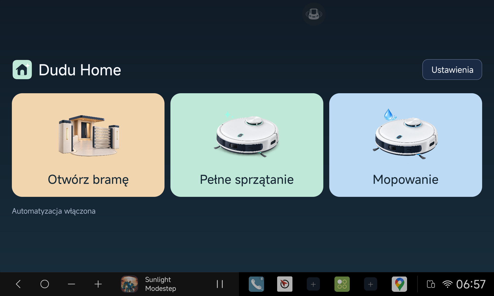

# Dudu Home

**Your gate. Your cleaning routines. One touch - or the right moment on your journey.**

A small Android app for a DUDU7 head unit. It opens a gate by asking the Bluetooth-paired
**phone** to make a short call, and sends existing **Full Cleaning** and **Full Mop** routines to Roborock.
Private, locally configured route detection connects those actions to leaving and returning home.
It also starts Yanosik in the background after sustained driving, keeping the radio screen visible.

> **Current source: `0.4.0-local`.** Installed on DUDU7. Migration to
> `com.pbuchman.duduhome`, configuration, menu and monitoring were verified.
> Yanosik passed a real full-restart, movement and background-warning-overlay check.
> Gate and Roborock manual actions were verified on the preceding package version.
> **Automatic home journeys and manufacturer ignition/wake acceptance remain pending.**
> The original gate-call baseline remains at `v0.1.0-baseline`. Source publication is not a
> fully verified production release. No public APK is provided.



## What it does

- **Otwórz bramę:** use the paired phone's SIM, observe outgoing, wait five seconds, hang up
  and confirm idle. Never use the head unit's SIM or interrupt a pre-existing conversation.
- **Pełne sprzątanie (Full Cleaning):** send the saved Roborock routine. This is not a generic “clean” command;
  the routine's rooms and settings remain managed in the Roborock phone app.
- **Mopowanie (Full Mop):** send its separate saved routine, **manual only**. No GPS trigger or daily quota.
  Missing Mop configuration never starts Full Cleaning instead.
- **Automatic gate calls:** sustained departure toward the gate and a directional return approach.
- **Automatic cleaning:** first outward crossing of the configured approach checkpoint each
  calendar day in `Europe/Warsaw`. **One automatic attempt, including failure or a blocked
  attempt. No automatic retry or offline queue.** Manual cleaning remains independent.
- A small **Ustawienia** entry for the gate number and Roborock credentials. No map editor.
- **Yanosik in the background:** one launch attempt per full system boot, after at least
  ten seconds of qualified GPS movement. The existing warning overlay remains above the
  radio screen. A stop or process restart does not rearm it. Manufacturer sleep/wake support
  is not implemented yet; see [verification and limitations](docs/YANOSIK.md).

Opening the menu, saving configuration, starting the radio or reaching the end of a cooldown
does **not** itself call or start cleaning. Manual actions return to the menu. Automatic actions
hide after the result unless the menu was already open. Success stays for five seconds.
Errors stay until user action.

No robot stop, pause, docking, status polling, Python runtime on Android, analytics, Home Assistant
or Google Home dependency. Roborock requires Internet; gate calls use the paired phone's network.

## Hardware evidence, not promises

The original gate executor was exercised on **DUDU7, Android 13, DUDUOS 3.7 build 260210**,
with one connected phone: idle → dial → outgoing → delay → hangup → idle. The disconnected
phone path was also checked. On 2026-09-08 the combined APK was installed on that radio:
both manual tiles returned to the menu after gate-call success / Roborock cloud acceptance,
and background GPS delivery was verified. Automatic journeys and ignition/wake acceptance
remain pending; see the [verification ledger](docs/VERIFICATION.md).

The implementation uses undocumented DUDU/SYU IPC; other firmware and two-phone setups are not
certified. It cannot detect the first ringback, reception by the controller, or physical gate
opening. Roborock's accepted response confirms the cloud request, **not completed cleaning or
even physical robot movement**. Previous computer-side routine experiments are not radio tests.

## Build and verification

JDK 17, Android SDK Platform 36 and Build Tools 35.0.0 are required. Set `ANDROID_HOME`
(or an untracked `local.properties`). Java 17, platform Views/XML, minimum API 26, target API 36.
There are no external Android runtime libraries.

```sh
./gradlew assembleDebug assembleDebugAndroidTest lintDebug
bash scripts/check-detector.sh
python3 scripts/test-private-tools.py
python3 scripts/test-fresh-installer.py
./scripts/run-emulator-check.sh
python3 scripts/test-install-emulator.py emulator-5554
python3 scripts/check-public-tree.py --working-tree --all-history
```

Start an emulator first for the last installation check. Emulator checks use synthetic data and
never contact a real robot. They cannot certify Bluetooth IPC, GNSS reception or vendor wake behavior.

Local artifact: `app/build/outputs/apk/debug/app-debug.apk`. Source only is published under MIT:
**no public APK, credentials or signing key**. The local package is `com.pbuchman.duduhome`;
the legacy package is `pl.piotrbuchman.dudugate`. Use the explicit migration runbook
for that transition, not an ordinary update. Keep the matching signing certificate.

## Install safely

Use the [migration runbook](docs/MIGRATION.md) for the old radio package. For an already
migrated installation, use the [complete installation runbook](docs/OPERATIONS.md), including private backups,
signature comparison and all three configuration sections. For an existing radio installation:

```sh
python3 scripts/configure-device.py DEVICE_SERIAL "$PRIVATE_DIR/config.json" \
  --roborock "$PRIVATE_DIR/roborock/routine-credentials.json" \
  --apk app/build/outputs/apk/debug/app-debug.apk \
  --backup-dir "$PRIVATE_DIR/radio-backups" --enable-automation
```

`PRIVATE_DIR` is an owner-only directory outside every repository. The installer checks the
configured number against the radio, stages data via stdin, and never launches an action.
Open the app **while parked** to consume the import. Do not update during a call or other action.
The fresh-install helper refuses to update an existing app; use the backed-up path above.
It requires an explicit device, stops on failed/empty/unrecognized ADB checks, includes packages
with retained data, and never passes the replacement flag `-r` to installation.

No home GPS configuration disables home-route automation, not the independent movement hook
or manual tiles. No gate number blocks calls;
no Roborock bundle blocks cleaning. Saving a number imposes a persistent 60-second call block.
Saving Roborock credentials never starts cleaning or resets the daily limit.

## Privacy and maintenance

Real numbers (including fragments), home coordinates, street names, route recordings, account
credentials, routine IDs, device addresses and signing keys stay outside Git and the APK.
Roborock credentials are encrypted with Android Keystore in private no-backup storage. The
short-lived import file is deleted after successful import. App backups are disabled.
An authorized ADB/debug session is privileged access: keep it restricted and disconnect afterward.

Logs contain event/result categories, never credential bundles, authorization headers or coordinates.
Check private archives and diagnostics before sharing: firmware-generated logs may contain data
even when Dudu Home does not log it. Automated privacy scans supplement manual review.

## Documentation for the next developer

- [Functional contract](docs/FUNCTIONAL.md): buttons, triggers, once-a-day behavior and failure cases.
- [Architecture and Roborock protocol](docs/ROBOROCK.md): native HTTPS, credentials and boundaries.
- [DUDU/SYU technical notes](docs/TECHNICAL_NOTES.md): preserved calling safety and IPC details.
- [Installation, recovery and credential renewal](docs/OPERATIONS.md).
- [Implementation and acceptance plan](docs/PLAN.md), [verification evidence](docs/VERIFICATION.md).
- [Decisions](docs/DECISIONS.md), [change history](CHANGELOG.md), [handoff](docs/LOCAL_DEVELOPMENT.md).
- [Design and illustration prompts](docs/DESIGN.md), [next queued work](docs/ROADMAP.md).

## License

[MIT](LICENSE): use, modify and redistribute, including commercially, with the license notice.
The independent [FytBt project](https://github.com/PimpinPumpkin/FytBt) corroborates the Binder
approach on related FYT hardware. Roborock request signing was ported from the
[python-roborock implementation](https://github.com/Python-roborock/python-roborock).
Dudu Home is not an official DUDU or Roborock product.
