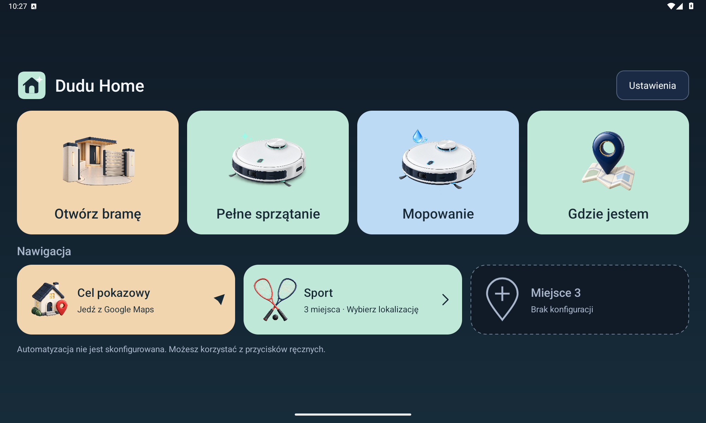
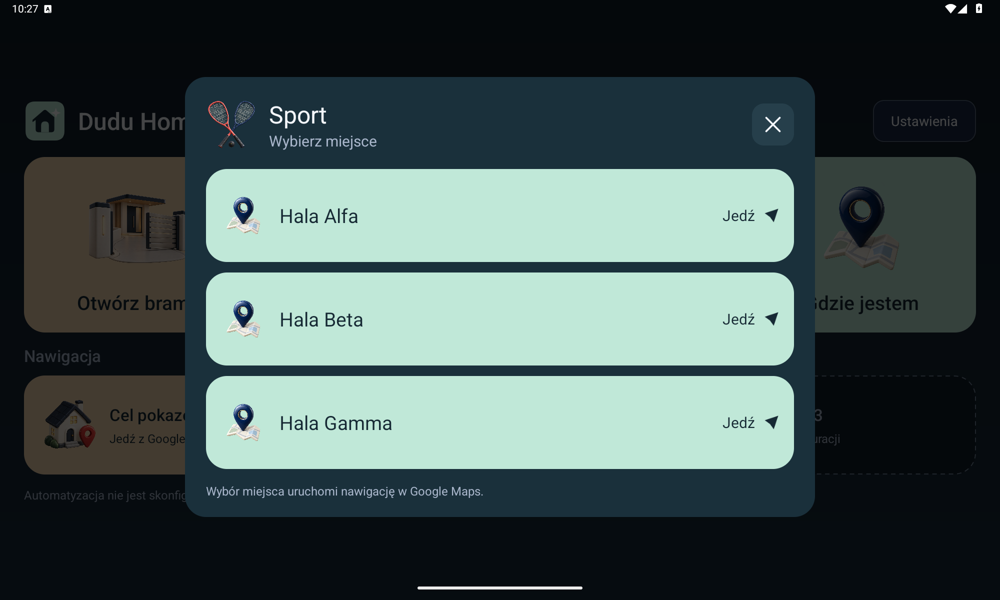
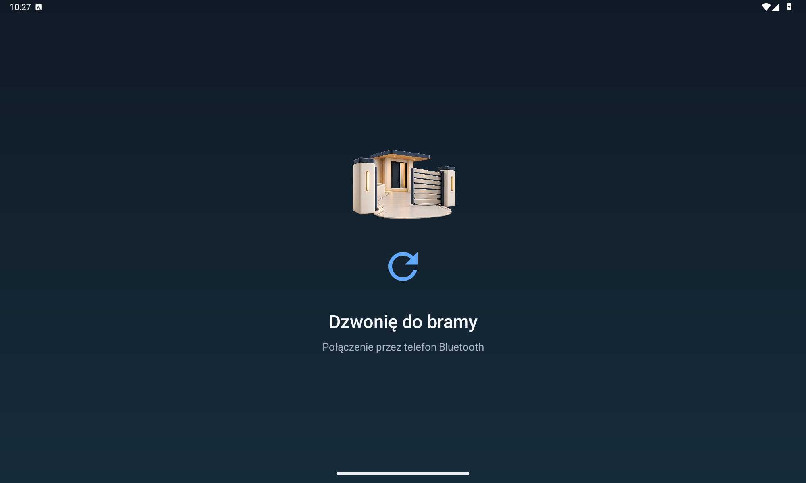
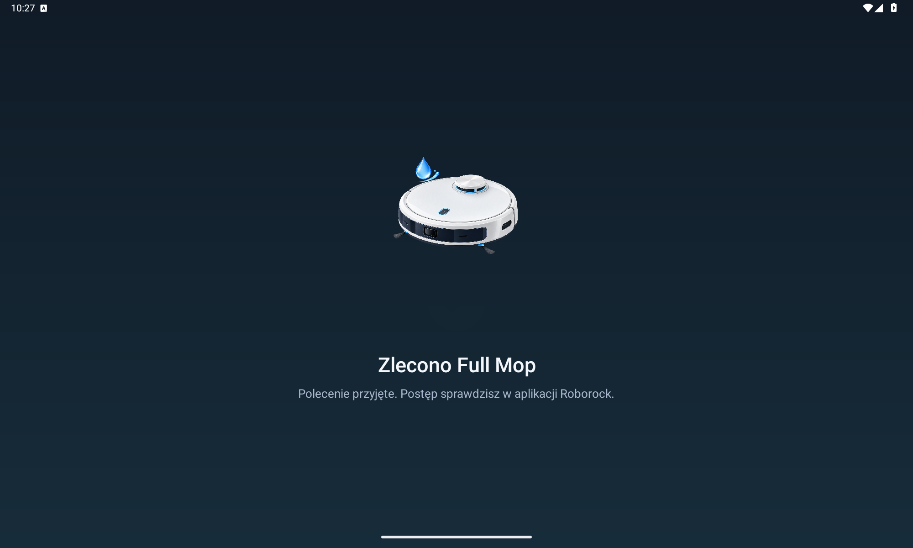
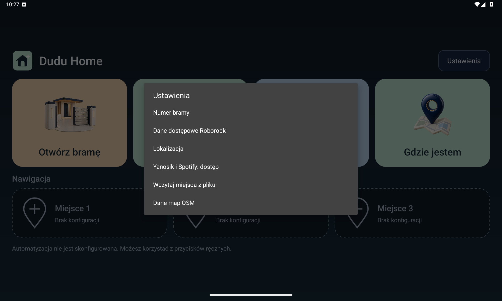
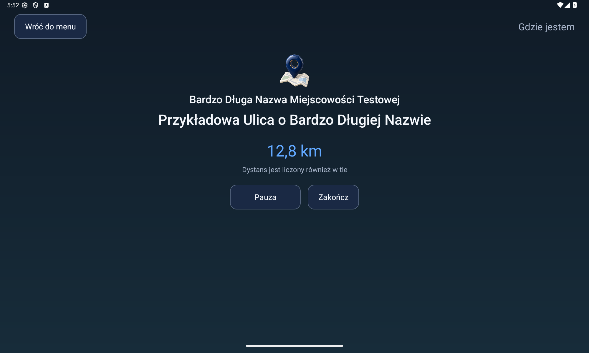
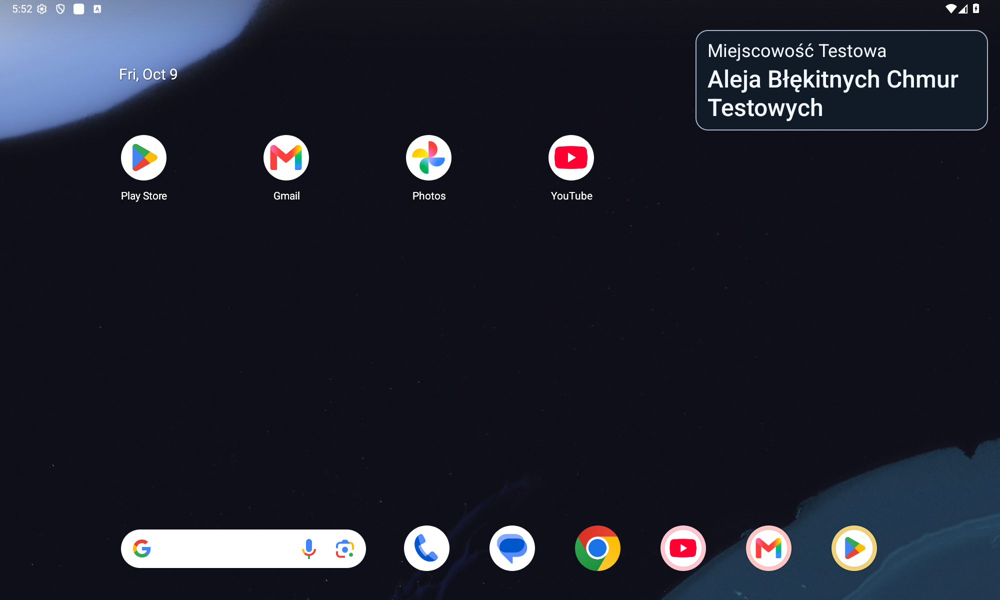
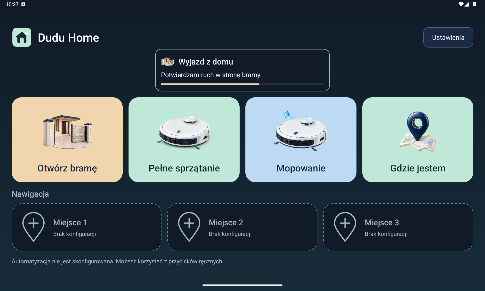
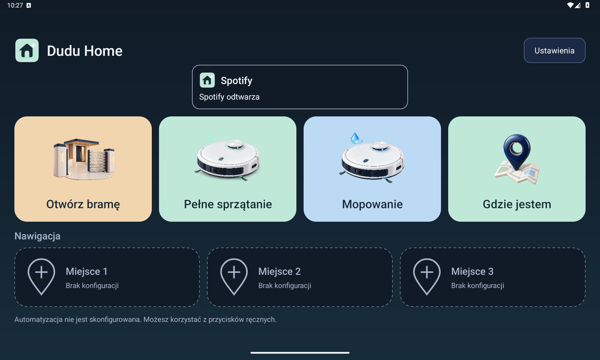

# Dudu Home

**Your gate. Your cleaning routines. Your destinations. One touch.**

A small Android app for a DUDU7 head unit. It opens a gate by asking the Bluetooth-paired
**phone** to make a short call, and sends existing **Full Cleaning** and **Full Mop** routines to Roborock.
Private, locally configured route detection connects those actions to leaving and returning home.
After sustained driving it starts Yanosik, then opens Spotify and requests local music playback.
Ready actions have an explicit order: **gate → cleaning → Yanosik → Spotify**.
Before generic driving detection, a location precondition gives a possible gate departure or
return priority even when its call event is not ready yet. Media waits for a successful gate
call or fresh evidence that the gate area no longer applies. No fixed delay bypasses this check.
Spotify stays on screen; there is no additional desktop request. A manual Maps choice suppresses
pending media startup so it cannot cover the chosen navigation.

> **Combined test candidate `1.3.0-rc2` (code 22).**
> Adds readable long street names and current-attempt cancellation to Where am I,
> automation and the combined Routebook baseline. [Release notes](docs/RELEASE_1_3_0_RC2.md).
> Android, backend, private map UI and deployment tooling now share one source revision.
> Hardware GPS, delivery and sleep/wake acceptance remain pending. Stable 1.1.0 is the
> last recorded radio-verified release. See [combined handoff](docs/INTEGRATED_RELEASE.md).
> Source only: no public APK, map database, private configuration or signing key.



These are captures of running Android Views with invented fixture data. The menu and earlier
action screenshots are the historical 1.2 baseline; they predate cancellation controls. The
new street captures below include local implementation changes on code 21 before the code 22
version bump. [Gallery manifests and provenance](docs/UI_GALLERY.md) distinguish both sets.
Screenshots do not certify physical gate/robot actions, radio touch, driving or sleep/wake.

| Navigation groups | Gate execution |
| --- | --- |
|  |  |
| **Cleaning and manual mop** | **Settings and private setup** |
|  |  |
| **Current place and trip distance** | **Minimal background overlay** |
|  |  |
| **Automation progress** | **Media playback feedback** |
|  |  |

## Routebook build

```sh
bash scripts/check-routebook.sh
cd routebook
npm ci
npm run build
npm test
```

[Routebook setup and integration tests](routebook/README.md) use checked-in synthetic fixtures.
Server runtime secrets and actual recorded locations remain outside the repository.

## What it does

- **Otwórz bramę:** use the paired phone's SIM, observe outgoing, wait five seconds, hang up
  and confirm idle. Never use the head unit's SIM or interrupt a pre-existing conversation.
- **Pełne sprzątanie (Full Cleaning):** send the saved Roborock routine. This is not a generic “clean” command;
  the routine's rooms and settings remain managed in the Roborock phone app.
- **Mopowanie (Full Mop):** send its separate saved routine, **manual only**. No GPS trigger or daily quota.
  Missing Mop configuration never starts Full Cleaning instead.
- **Gdzie jestem:** explicitly start, pause, resume or end a trip. Show locality, street and
  session kilometres. Count qualified GPS movement in the background; show a silent card with up to three readable street lines
  and an expanded full-address notification that open the full screen when tapped. Local OSM data works offline;
  keyless Photon can supplement incomplete results. Gate, cleaning and media retain priority.
  [Behavior, data, privacy and limitations](docs/WHERE_AM_I.md).
- **Routebook:** automatically collect GPS independently of the manual trip counter, retain
  unacknowledged points in SQLite and send the newest fix before historical backlog. The
  private web map shows live/day/range history, observed stops and distance summaries.
  Upload needs separate private provisioning; [architecture and pairing](docs/ROUTEBOOK.md).
- **Automatic gate calls:** sustained departure toward the gate and a directional return approach.
- **Automatic cleaning:** first outward crossing of the configured approach checkpoint each
  calendar day in `Europe/Warsaw`. **One automatic attempt, including failure or a blocked
  attempt. Explicit user cancellation before sending releases the opportunity.
  No automatic retry or persisted queue.** It may wait up to 120 seconds behind a gate
  action and its result screen; non-user failures and expiry still consume the daily attempt. Manual cleaning remains independent.
- **Three Google Maps navigation slots:** private JSON import, generic icons and empty-slot guidance.
  Each slot accepts up to 12 ordered places: zero shows setup guidance, one starts navigation
  directly, and two, three or more open a modal chooser. Add a third place by appending to the
  private JSON and importing it again; no source edit or rebuild is needed. [File format and behavior](docs/NAVIGATION.md).
- A small **Ustawienia** entry for the gate number and Roborock credentials. No map editor.
- **Yanosik startup:** one launch attempt per full system boot or identified DUDU wake cycle, after at least
  ten seconds of qualified GPS movement. First check its foreground-service notification.
  If work is detected, do not reopen Yanosik. Unknown state (including missing notification access)
  skips it without blocking Spotify. After a launch request allow ten seconds before Spotify;
  gate and cleaning take precedence. No desktop request, foreground-app tracking or automatic
  retry. A stop or process restart does not rearm a sent attempt. The DUDU ignition
  task restarted monitoring in one real wake test. See [startup recovery](docs/STARTUP_DIAGNOSTICS.md)
  and [limitations](docs/YANOSIK.md) for the first-wake fix and pending hardware acceptance.
- **Spotify resume:** open the radio's Spotify, then use only its unambiguous local Android
  media session. Send at most one `play()` and confirm `PLAYING`, not merely an accepted request.
  No playlist selection or remote Spotify Connect control. Cold-start session availability passed
  on the recorded code 13 radio test; see [queue and Spotify contract](docs/AUTOMATION_SEQUENCE.md).

**Anuluj tę próbę** is available during detection, queue wait and execution, including in a
notification when overlays are unavailable. It cancels only the current process occurrence;
Yanosik and Spotify share that control. A pre-send cancellation consumes no durable quota
or attempt history. A newly detected occurrence can start fresh after its required baseline.
Already sent commands cannot be undone; call/HTTP cleanup and durable safety blocks remain.
See [cancellation and UI](docs/PROGRESS_UI.md).

Opening the menu, saving configuration, starting the radio or reaching the end of a cooldown
does **not** itself call or start cleaning. Manual actions return to the menu. Automatic actions
hide after the result unless the menu was already open. Success stays for five seconds.
Errors stay until user action.

No robot stop, pause, docking, status polling, Python runtime on Android, analytics, Home Assistant
or Google Home dependency. Roborock requires Internet; gate calls use the paired phone's network.

## Hardware evidence, not promises

The original gate executor was exercised on **DUDU7, Android 13, DUDUOS 3.7 build 260210**,
with one connected phone: idle → dial → outgoing → delay → hangup → idle. The disconnected
phone path was also checked. On 2026-09-08 the combined APK was installed on that radio:
both manual tiles returned to the menu after gate-call success / Roborock cloud acceptance,
and background GPS delivery was verified. On 2026-09-12 a full reboot, one ignition recovery
and one automatic return call also passed. Further acceptance remains in the [verification ledger](docs/VERIFICATION.md).

The implementation uses undocumented DUDU/SYU IPC; other firmware and two-phone setups are not
certified. It cannot detect the first ringback, reception by the controller, or physical gate
opening. Roborock's accepted response confirms the cloud request, **not completed cleaning or
even physical robot movement**. Previous computer-side routine experiments are not radio tests.

## Build and verification

JDK 17, Android SDK Platform 36 and Build Tools 35.0.0 are required. Set `ANDROID_HOME`
(or an untracked `local.properties`). Java 17, platform Views/XML, minimum API 26, target API 36.
There are no external Android runtime libraries.

```sh
./gradlew assembleDebug assembleDebugAndroidTest lintDebug
bash scripts/check-trip.sh
python3 scripts/test-radio-update.py
bash scripts/check-detector.sh
python3 scripts/check-progress.py
python3 scripts/test-private-tools.py
python3 scripts/test-navigation.py
python3 scripts/test-public-tree.py
python3 scripts/test-fresh-installer.py
./scripts/run-emulator-check.sh
python3 scripts/test-install-emulator.py emulator-5554
python3 scripts/check-public-tree.py --working-tree --all-history
```

Start an emulator first for the last installation check. Emulator checks use synthetic data and
never contact a real robot. They cannot certify Bluetooth IPC, GNSS reception or vendor wake behavior.

Local artifact: `app/build/outputs/apk/debug/app-debug.apk`. Source only is published under MIT:
**no public APK, credentials or signing key**. The local package is `com.pbuchman.duduhome`;
the legacy package is `pl.piotrbuchman.dudugate`. Use the explicit migration runbook
for that transition, not an ordinary update. Keep the matching signing certificate.

## Install safely

Use the [migration runbook](docs/MIGRATION.md) for the old radio package. For an already
migrated installation, use the [complete installation runbook](docs/OPERATIONS.md), including private backups,
signature comparison and all supplied configuration sections. For an existing radio installation:

```sh
python3 scripts/configure-device.py DEVICE_SERIAL "$PRIVATE_DIR/config.json" \
  --roborock "$PRIVATE_DIR/roborock/routine-credentials.json" \
  --navigation "$PRIVATE_DIR/navigation.json" \
  --apk app/build/outputs/apk/debug/app-debug.apk \
  --backup-dir "$PRIVATE_DIR/radio-backups" --enable-automation
```

`PRIVATE_DIR` is an owner-only directory outside every repository. The installer checks the
configured number against the radio, stages data via stdin, and never launches an action.
For an unattended update, use `scripts/install-radio.py` from the operations runbook: it discovers
the authorized radio, performs idle preflight, installs the local map pack and opens/verifies the
menu automatically. Busy or inconclusive call/action state blocks the update.
The fresh-install helper refuses to update an existing app; use the backed-up path above.
It requires an explicit device, stops on failed/empty/unrecognized ADB checks, includes packages
with retained data, and never passes the replacement flag `-r` to installation.

No home GPS configuration disables home-route automation, not the independent movement hook
or manual tiles. No gate number blocks calls;
no Roborock bundle blocks cleaning. Saving a number imposes a persistent 60-second call block.
Saving Roborock credentials never starts cleaning or resets the daily limit.

For media automation, open **Ustawienia > Yanosik i Spotify: dostęp > Ustawienia systemowe**
and grant notification access to Dudu Home. Android grants broad access; our code only inspects
Yanosik's package and foreground-service flag, never notification contents or actions. Other
notifications are ignored. Spotify uses that same grant for Android media-session access,
without reading track metadata. Granting access does not launch anything or reset a consumed cycle.
The Yanosik notification signal passed on this radio; absence is not a universal
process-liveness check, and a detected service does not certify working hazard warnings.

## Privacy and maintenance

Real numbers (including fragments), home coordinates, street names, route recordings, account
credentials, routine IDs, device addresses and signing keys stay outside Git and the APK.
Roborock credentials are encrypted with Android Keystore in private no-backup storage. The
short-lived import file is deleted after successful import. App backups are disabled.
An authorized ADB/debug session is privileged access: keep it restricted and disconnect afterward.

Logs contain event/result categories, never credential bundles, authorization headers or coordinates.
Version 0.4.1 keeps a bounded private diagnostic journal across process restarts, recording
monitor startup, GPS delivery counts, events, blocked actions and results. This diagnostic journal is not uploaded.
Routebook separately sends configured GPS records
to its privately provisioned endpoint; without provisioning points remain on the radio.
Version 0.5 adds correlated detection/action transitions to that same journal, not per-frame
fill updates. UI reads process-local snapshots, never logs; restarting does not replay actions.
Check private archives and diagnostics before sharing: firmware-generated logs may contain data
even when Dudu Home does not log it. Automated privacy scans supplement manual review.

## Documentation for the next developer

- [Where am I](docs/WHERE_AM_I.md): trip sessions, OSM/Photon, distance and background priority.
- [Current full-app gallery](docs/UI_GALLERY.md): synthetic emulator captures and reproduction.
- [Private navigation destinations](docs/NAVIGATION.md): JSON schema, import and Maps launch.
- [Functional contract](docs/FUNCTIONAL.md): buttons, triggers, once-a-day behavior and failure cases.
- [Architecture and Roborock protocol](docs/ROBOROCK.md): native HTTPS, credentials and boundaries.
- [DUDU/SYU technical notes](docs/TECHNICAL_NOTES.md): preserved calling safety and IPC details.
- [Installation, recovery and credential renewal](docs/OPERATIONS.md).
- [Implementation and acceptance plan](docs/PLAN.md), [verification evidence](docs/VERIFICATION.md).
- [Decisions](docs/DECISIONS.md), [change history](CHANGELOG.md), [handoff](docs/LOCAL_DEVELOPMENT.md).
- [Release readiness and remaining hardware checks](docs/RELEASE_READINESS.md).
- [Design and illustration prompts](docs/DESIGN.md), [next queued work](docs/ROADMAP.md).
- [Progress UI and background communication](docs/PROGRESS_UI.md).

## License

[MIT](LICENSE): use, modify and redistribute, including commercially, with the license notice.
The independent [FytBt project](https://github.com/PimpinPumpkin/FytBt) corroborates the Binder
approach on related FYT hardware. Roborock request signing was ported from the
[python-roborock implementation](https://github.com/Python-roborock/python-roborock).
Map data is © OpenStreetMap contributors under [ODbL 1.0](https://www.openstreetmap.org/copyright),
independently of the application license. Local map packs are not public repository assets.
Dudu Home is not an official DUDU or Roborock product.
