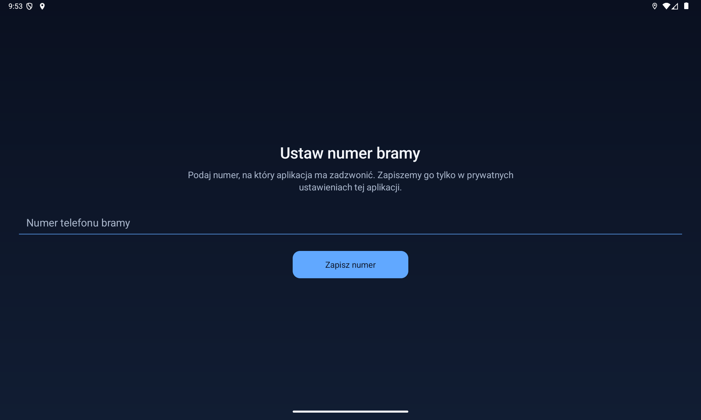

# Dudu Home

> **Local automation work in progress.** The published baseline is `v0.1.0-baseline`.
> This working branch adds the menu and external-config location monitoring; hardware
> verification is still pending. See [local development status](docs/LOCAL_DEVELOPMENT.md).
> The baseline description below is retained as the record of the published version.

**One tap. Your paired phone. A short call to your gate.**

A small Android application for DUDU7 head units. Dudu Home asks the Bluetooth-paired
phone to call your configured gate number, observes the outgoing call, hangs up after
five seconds, and closes after confirmation. It uses the **phone's SIM**, never the
head unit's SIM.



## Available today

- A one-time phone-number setup, stored only in private app settings.
- Launch-to-call flow with visible progress, success animation and actionable errors.
- Protection against duplicate calls: one attempt at a time and a persistent 60-second cooldown.
- No location collection, analytics, accounts, Internet permission or external app libraries.
- Java 17, Android Views/XML and a small, inspectable Binder implementation.

**Saving the number does not place a call.** In this baseline, setup confirms the save
and closes. Subsequent deliberate launches start the calling flow. The cooldown applies
after a dial attempt, not after the initial number save.

## Hardware verification and limits

The calling implementation was exercised on a physical **DUDU7, Android 13,
DUDUOS 3.7 build 260210**, with one connected phone: idle → dial → outgoing →
five-second delay → hangup → idle. The disconnected-phone path was also verified.

This is device-specific software using undocumented DUDU/SYU IPC, not a universal
Android dialer. Other firmware, two connected phones and vendor updates are not certified.
The app cannot detect the first ringback tone, reception by the gate controller, or the
physical opening of the gate. “Sygnał wysłany” reports the observed call sequence only.
The public baseline retains that implementation with branding and privacy changes;
those changes do not constitute a new hardware certification.

## Build

Install JDK 17 and Android SDK Platform 36. Set `ANDROID_HOME` to your SDK, or create an
untracked `local.properties` with `sdk.dir` pointing to it. Then run:

```sh
./gradlew assembleDebug lintDebug
```

APK: `app/build/outputs/apk/debug/app-debug.apk`.
Minimum Android version: 8.0 (API 26). Compilation/target API: 36.

This repository publishes **source code only**, not signed release APKs. Local builds
use your existing Android debug key. Android requires the same application ID and signing
certificate to update an existing installation. Keep your key private; never uninstall
an existing installation merely to bypass a signature mismatch without backing up settings.
The internal ID remains `pl.piotrbuchman.dudugate` for update compatibility.

## Install and configure

With an authorized ADB connection:

```sh
./scripts/install-on-device.sh DEVICE_SERIAL
```

The installer **does not launch the app or place a call**. Alternatively, install the
locally built APK from a USB drive using the head unit's file manager.

1. Open **Dudu Home** while safely parked.
2. Enter your gate number and save. No call is made during setup.
3. Ensure the intended phone is paired and connected to the radio.
4. Launch Dudu Home again when you want to send the gate signal.

The UI is in Polish. Errors stay visible until you select retry or close. There is no
automatic redial. To reset the number, clear Dudu Home's app storage in Android settings;
this removes its settings, unlike clearing the cache.

## Safety and privacy

- Dial only after fresh, unambiguous idle; never interrupt an existing conversation.
- Register callbacks before dial; no protocol fallback after sending a dial command.
- Hang up only after this attempt has initiated its own call.
- Confirm outgoing and subsequent idle before reporting success.
- Persist the dial reservation before sending the command, including across process restarts.
- Backup of app settings is disabled. Phone numbers and their suffixes are not logged.
- No real phone numbers, street names, home coordinates, traces or signing keys belong in Git.

Abrupt power loss or a vendor Binder transaction that never returns can prevent cleanup.
Do not treat this application as proof that a gate has opened. Operate the UI only when safe.

## Verification

```sh
./gradlew assembleDebug lintDebug
./scripts/run-emulator-check.sh
python3 scripts/check-public-tree.py
```

The emulator check uses **only an emulator** and clears this app's emulator data. It checks
first-run setup without a dial attempt, validation, cooldown persistence and clock rollback.
An emulator cannot verify the private DUDU Bluetooth
service. Before using a new build on hardware, check connected/disconnected phone behavior,
busy-call protection, cooldown, outgoing/hangup/idle and recovery after power interruption.

See [technical notes](docs/TECHNICAL_NOTES.md), [design decisions](docs/DECISIONS.md)
and the [implementation plan](docs/PLAN.md).

## Next, not shipped in this baseline

A large-button menu and location-triggered gate calls, sharing the existing safe call
executor. Location configuration will stay external to the code and APK. Other home actions
are intentionally deferred. Calibration recordings are private and are not part of this repo.

## License and acknowledgements

[MIT](LICENSE) — use, modify and redistribute, including commercially, with the license notice.
DUDU/SYU firmware analysis informed the IPC contract. The independent
[FytBt project](https://github.com/PimpinPumpkin/FytBt) corroborates the Binder approach on
related FYT hardware. Dudu Home is an independent project, not an official DUDU product.
