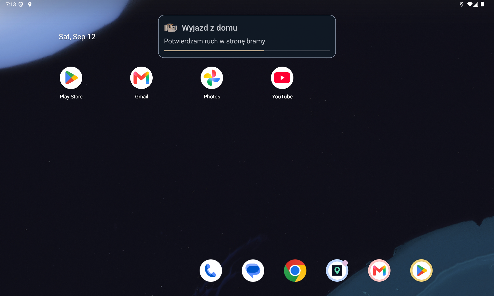

# Dudu Home

**Your gate. Your cleaning routines. Your destinations. One touch.**

A small Android app for a DUDU7 head unit. It opens a gate by asking the Bluetooth-paired
**phone** to make a short call, and sends existing **Full Cleaning** and **Full Mop** routines to Roborock.
Private, locally configured route detection connects those actions to leaving and returning home.
After sustained driving it starts Yanosik, then opens Spotify and requests local music playback.
Ready actions have an explicit order: **gate → cleaning → Yanosik → Spotify**.
Spotify stays on screen; there is no additional desktop request. A manual Maps choice suppresses
pending media startup so it cannot cover the chosen navigation.

> **Current source and verified radio installation: `1.0.0-rc2` (code 15), September 26.**
> All three tiles started Google Maps guidance in rc1. In rc2, one destination explicitly
> uses its full address to avoid an unwanted business name; its saved label passed on DUDU7.
> The backed-up update preserved existing data. Remaining wake/journey checks still prevent
> a final 1.0 release claim; see the [verification ledger](docs/VERIFICATION.md).
> Includes notification-based Yanosik presence checks and earlier return progress from 0.5.2.
> Notification access requires a one-time system grant. Detection of an already-running
> Yanosik passed on DUDU7 without reopening it or requesting HOME.
> **Intermittent failures also followed shorter stops.** A wake-task trimming race was captured
> and fixed in 0.5.3; repeated manufacturer wake reliability still requires verification.
> The backed-up DUDU7 update, private configuration import and fresh GPS delivery passed.
> On `0.5.0`, monitoring recovered automatically after full reboot and one real ignition cycle.
> The real movement banner and an automatic return call passed; the owner confirmed gate opening.
> On 0.5.4, automatic launch, desktop return and real warning overlays passed on DUDU7.
> Version 0.5.5 fixes the first-wake session baseline in code: a verified empty cold-start
> observation establishes zero without granting an extra attempt. Unknown reads never do.
> On 0.5.6, a backed-up update and full reboot passed: automatic monitoring, cold baseline zero,
> movement-triggered Yanosik, then Spotify with a local session reporting PLAYING. Yanosik warnings
> remained visible. Audible sound still needs confirmation; playback state alone is not proof.
> **Full wake acceptance and gate/cleaning contention on 0.5.6 remain pending.**
> Gate and Roborock manual actions were verified on the preceding package version.
> **Remaining departure, cleaning and repeated wake checks are still pending.**
> The original gate-call baseline remains at `v0.1.0-baseline`. Source publication is not a
> fully verified production release. No public APK is provided.


[Empty navigation slots](docs/images/navigation-empty.png) · [Earlier radio menu](docs/images/menu-dudu7.png)

The new screenshot uses invented labels and synthetic coordinates. Actual destination files and
radio screenshots remain private.

### See what the automation is detecting

A small, silent banner shows real GPS evidence before an automatic action. It sits above the
current app or inside the open Dudu Home menu, never both. It cannot receive touches, steal
focus, advance on its own or trigger an action. Cancelled detection shows a short reason.
Gate and cleaning use the existing execution screen; Yanosik only reports the launch request.



[Inside the menu](docs/images/progress-menu.png) · [Cancelled detection](docs/images/progress-cancelled.png) ·
[Existing action view, synthetic preview without a call](docs/images/progress-action.png)

[Return before the turn](docs/images/progress-return-early.png) ·
[Return approaching the gate](docs/images/progress-return-inbound.png)

Local checks include all eight recorded routes against the pre-UI detector. The earlier 0.5.0
movement overlay and automatic return call passed on the radio; the new return stages await testing.
See the [UI/background contract](docs/PROGRESS_UI.md) for exact meanings and limits.

## What it does

- **Otwórz bramę:** use the paired phone's SIM, observe outgoing, wait five seconds, hang up
  and confirm idle. Never use the head unit's SIM or interrupt a pre-existing conversation.
- **Pełne sprzątanie (Full Cleaning):** send the saved Roborock routine. This is not a generic “clean” command;
  the routine's rooms and settings remain managed in the Roborock phone app.
- **Mopowanie (Full Mop):** send its separate saved routine, **manual only**. No GPS trigger or daily quota.
  Missing Mop configuration never starts Full Cleaning instead.
- **Automatic gate calls:** sustained departure toward the gate and a directional return approach.
- **Automatic cleaning:** first outward crossing of the configured approach checkpoint each
  calendar day in `Europe/Warsaw`. **One automatic attempt, including failure or a blocked
  attempt. No automatic retry or persisted queue.** It may wait up to 120 seconds behind a gate
  action and its result screen; the daily attempt remains consumed. Manual cleaning remains independent.
- **Three Google Maps destinations:** private JSON import, generic icons, empty-slot guidance and
  one-tap driving navigation. [File format and behavior](docs/NAVIGATION.md).
- A small **Ustawienia** entry for the gate number and Roborock credentials. No map editor.
- **Yanosik startup:** one launch attempt per full system boot or identified DUDU wake cycle, after at least
  ten seconds of qualified GPS movement. First check its foreground-service notification.
  If work is detected, do not reopen Yanosik. Unknown state (including missing notification access)
  skips it without blocking Spotify. After a launch request allow ten seconds before Spotify;
  gate and cleaning take precedence. No desktop request, foreground-app tracking or automatic
  retry. A stop or process restart does not rearm it. The DUDU ignition
  task restarted monitoring in one real wake test. See [startup recovery](docs/STARTUP_DIAGNOSTICS.md)
  and [limitations](docs/YANOSIK.md) for the first-wake fix and pending hardware acceptance.
- **Spotify resume:** open the radio's Spotify, then use only its unambiguous local Android
  media session. Send at most one `play()` and confirm `PLAYING`, not merely an accepted request.
  No playlist selection or remote Spotify Connect control. Cold-start session availability passed
  on the recorded code 13 radio test; see [queue and Spotify contract](docs/AUTOMATION_SEQUENCE.md).

Opening the menu, saving configuration, starting the radio or reaching the end of a cooldown
does **not** itself call or start cleaning. Manual actions return to the menu. Automatic actions
hide after the result unless the menu was already open. Success stays for five seconds.
Errors stay until user action.

No robot stop, pause, docking, status polling, Python runtime on Android, analytics, Home Assistant
or Google Home dependency. Roborock requires Internet; gate calls use the paired phone's network.

## Hardware evidence, not promises

The original gate executor was exercised on **DUDU7, Android 13, DUDUOS 3.7 build 260210**,
with one connected phone: idle → dial → outgoing → delay → hangup → idle. The disconnected
phone path was also checked. On 2026-09-08 the combined APK was installed on that radio:
both manual tiles returned to the menu after gate-call success / Roborock cloud acceptance,
and background GPS delivery was verified. On 2026-09-12 a full reboot, one ignition recovery
and one automatic return call also passed. Further acceptance remains in the [verification ledger](docs/VERIFICATION.md).

The implementation uses undocumented DUDU/SYU IPC; other firmware and two-phone setups are not
certified. It cannot detect the first ringback, reception by the controller, or physical gate
opening. Roborock's accepted response confirms the cloud request, **not completed cleaning or
even physical robot movement**. Previous computer-side routine experiments are not radio tests.

## Build and verification

JDK 17, Android SDK Platform 36 and Build Tools 35.0.0 are required. Set `ANDROID_HOME`
(or an untracked `local.properties`). Java 17, platform Views/XML, minimum API 26, target API 36.
There are no external Android runtime libraries.

```sh
./gradlew assembleDebug assembleDebugAndroidTest lintDebug
bash scripts/check-detector.sh
python3 scripts/check-progress.py
python3 scripts/test-private-tools.py
python3 scripts/test-navigation.py
python3 scripts/test-public-tree.py
python3 scripts/test-fresh-installer.py
./scripts/run-emulator-check.sh
python3 scripts/test-install-emulator.py emulator-5554
python3 scripts/check-public-tree.py --working-tree --all-history
```

Start an emulator first for the last installation check. Emulator checks use synthetic data and
never contact a real robot. They cannot certify Bluetooth IPC, GNSS reception or vendor wake behavior.

Local artifact: `app/build/outputs/apk/debug/app-debug.apk`. Source only is published under MIT:
**no public APK, credentials or signing key**. The local package is `com.pbuchman.duduhome`;
the legacy package is `pl.piotrbuchman.dudugate`. Use the explicit migration runbook
for that transition, not an ordinary update. Keep the matching signing certificate.

## Install safely

Use the [migration runbook](docs/MIGRATION.md) for the old radio package. For an already
migrated installation, use the [complete installation runbook](docs/OPERATIONS.md), including private backups,
signature comparison and all supplied configuration sections. For an existing radio installation:

```sh
python3 scripts/configure-device.py DEVICE_SERIAL "$PRIVATE_DIR/config.json" \
  --roborock "$PRIVATE_DIR/roborock/routine-credentials.json" \
  --navigation "$PRIVATE_DIR/navigation.json" \
  --apk app/build/outputs/apk/debug/app-debug.apk \
  --backup-dir "$PRIVATE_DIR/radio-backups" --enable-automation
```

`PRIVATE_DIR` is an owner-only directory outside every repository. The installer checks the
configured number against the radio, stages data via stdin, and never launches an action.
Open the app **while parked** to consume the import. Do not update during a call or other action.
The fresh-install helper refuses to update an existing app; use the backed-up path above.
It requires an explicit device, stops on failed/empty/unrecognized ADB checks, includes packages
with retained data, and never passes the replacement flag `-r` to installation.

No home GPS configuration disables home-route automation, not the independent movement hook
or manual tiles. No gate number blocks calls;
no Roborock bundle blocks cleaning. Saving a number imposes a persistent 60-second call block.
Saving Roborock credentials never starts cleaning or resets the daily limit.

For media automation, open **Ustawienia > Yanosik i Spotify: dostęp > Ustawienia systemowe**
and grant notification access to Dudu Home. Android grants broad access; our code only inspects
Yanosik's package and foreground-service flag, never notification contents or actions. Other
notifications are ignored. Spotify uses that same grant for Android media-session access,
without reading track metadata. Granting access does not launch anything or reset a consumed cycle.
The Yanosik notification signal passed on this radio; absence is not a universal
process-liveness check, and a detected service does not certify working hazard warnings.

## Privacy and maintenance

Real numbers (including fragments), home coordinates, street names, route recordings, account
credentials, routine IDs, device addresses and signing keys stay outside Git and the APK.
Roborock credentials are encrypted with Android Keystore in private no-backup storage. The
short-lived import file is deleted after successful import. App backups are disabled.
An authorized ADB/debug session is privileged access: keep it restricted and disconnect afterward.

Logs contain event/result categories, never credential bundles, authorization headers or coordinates.
Version 0.4.1 keeps a bounded private diagnostic journal across process restarts, recording
monitor startup, GPS delivery counts, events, blocked actions and results. Nothing is uploaded.
Version 0.5 adds correlated detection/action transitions to that same journal, not per-frame
fill updates. UI reads process-local snapshots, never logs; restarting does not replay actions.
Check private archives and diagnostics before sharing: firmware-generated logs may contain data
even when Dudu Home does not log it. Automated privacy scans supplement manual review.

## Documentation for the next developer

- [Private navigation destinations](docs/NAVIGATION.md): JSON schema, import and Maps launch.
- [Functional contract](docs/FUNCTIONAL.md): buttons, triggers, once-a-day behavior and failure cases.
- [Architecture and Roborock protocol](docs/ROBOROCK.md): native HTTPS, credentials and boundaries.
- [DUDU/SYU technical notes](docs/TECHNICAL_NOTES.md): preserved calling safety and IPC details.
- [Installation, recovery and credential renewal](docs/OPERATIONS.md).
- [Implementation and acceptance plan](docs/PLAN.md), [verification evidence](docs/VERIFICATION.md).
- [Decisions](docs/DECISIONS.md), [change history](CHANGELOG.md), [handoff](docs/LOCAL_DEVELOPMENT.md).
- [Design and illustration prompts](docs/DESIGN.md), [next queued work](docs/ROADMAP.md).
- [Progress UI and background communication](docs/PROGRESS_UI.md).

## License

[MIT](LICENSE): use, modify and redistribute, including commercially, with the license notice.
The independent [FytBt project](https://github.com/PimpinPumpkin/FytBt) corroborates the Binder
approach on related FYT hardware. Roborock request signing was ported from the
[python-roborock implementation](https://github.com/Python-roborock/python-roborock).
Dudu Home is not an official DUDU or Roborock product.
